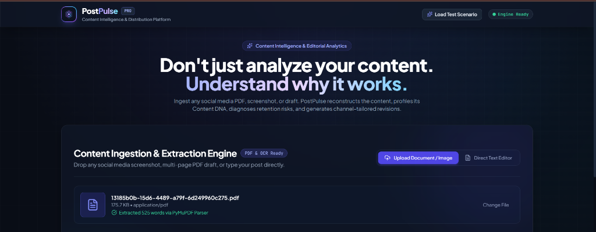
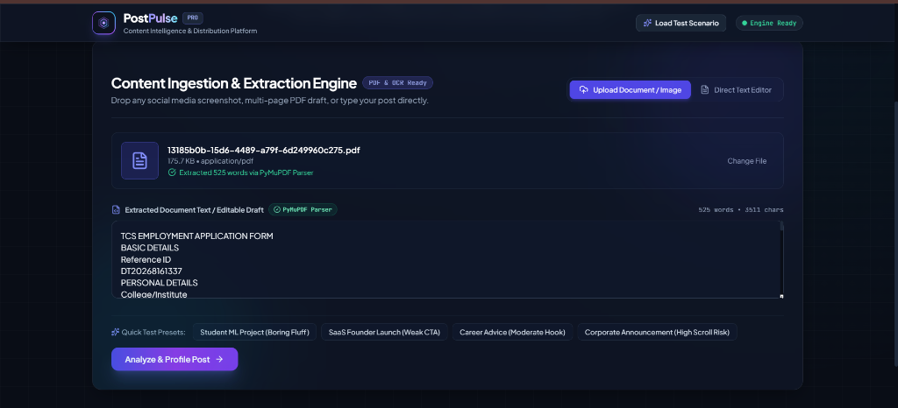
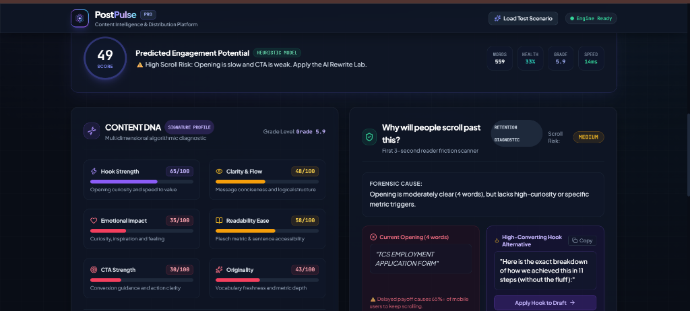
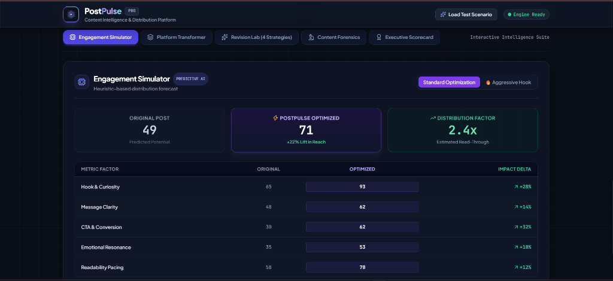
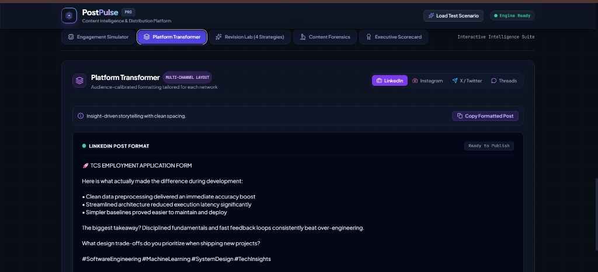

# ⚡ PostPulse — Social Media Content Intelligence & Digital Twin Platform

<div align="center">


[](https://python.org)
[](https://fastapi.tiangolo.com)
[](https://react.dev)
[](https://www.typescriptlang.org)
[](https://tailwindcss.com)
[](https://pytest.org)
[](https://docker.com)

<br />

### **"Don't just analyze your content. Understand why it works."**

*An AI-powered social media intelligence platform that ingests multi-page PDFs, mobile screenshots, and raw drafts to profile Content DNA, diagnose retention scroll risks, forecast reach deltas, and generate channel-tailored revisions.*

<br />

[✨ Visual Product Tour](#-visual-product-tour) • [🏛️ System Architecture](#-system-architecture) • [🚀 Features](#-core-capabilities) • [⚡ Quick Start](#-quick-start-guide) • [🌐 Cloud Deployment](#-cloud-hosting--deployment) • [🧪 Testing](#-test-suite--quality-assurance)

</div>

---

<br />

## 🌟 Executive Summary & Problem Solved

Most creator tools act merely as basic character counters or superficial grammar checkers. They fail to address the critical algorithmic and psychological dynamics that determine content success on modern feeds:

1. **The 3-Second Retention Window**: Why do 65%+ of mobile readers scroll past within the opening 2 sentences?
2. **Multi-Format Ingestion Barrier**: How do you extract and analyze drafts locked inside PDFs, camera photos, or dark-mode screenshots?
3. **Cross-Platform Tone Mismatch**: How do you recalibrate a single core idea into an authoritative LinkedIn post, a high-save Instagram carousel caption, and a punchy 3-part X (Twitter) thread without sounding robotic?

**PostPulse** delivers an end-to-end solution combining **PyMuPDF structural parsing**, **Windows Native & Tesseract OCR**, and a **sub-20ms deterministic NLP heuristics engine**.

---

<br />

## 📸 Visual Product Tour

<br />

### 1. Ingestion & Dual-Engine Document Extraction
> *Drop multi-page PDF drafts or image screenshots. PostPulse automatically extracts and synchronizes document text in milliseconds.*

<div align="center">
  
</div>

<br />

**Key Capabilities in this View:**
- **PyMuPDF Parser**: Preserves multi-column layout, headings, and document hierarchy.
- **Universal Multi-Pass OCR**: Fast extraction for phone screenshots, WhatsApp photos, and dark-mode graphics.
- **Live Ingestion Telemetry**: Real-time word count, character metrics, and engine status indicators.

<br />
<br />

---

<br />

### 2. Extracted Text Draft Synchronizer & Preset Scenarios
> *Review, edit, or test pre-configured benchmark posts with instant word/character telemetry.*

<div align="center">
  
</div>

<br />

**Key Capabilities in this View:**
- **Synchronized Text Editor**: Allows inline editorial refinement before triggering diagnostic profiling.
- **Benchmark Presets**: One-click test scenarios for *Student ML Projects (Fluff)*, *SaaS Launches (Weak CTA)*, and *Corporate Announcements (High Scroll Risk)*.

<br />
<br />

---

<br />

### 3. Executive Score Banner, Content DNA Radar & Scroll Risk Scanner
> *Comprehensive 6-vector algorithmic diagnostic evaluating reader psychology and opening friction.*

<div align="center">
  
</div>

<br />

**Key Capabilities in this View:**
- **Executive Score Meter**: Radial predicted engagement potential calculated via heuristic modeling.
- **6-Vector Content DNA**: Multi-dimensional scoring across **Hook Strength**, **Clarity & Flow**, **Emotional Impact**, **Readability Ease (Flesch Grade)**, **CTA Strength**, and **Originality**.
- **Scroll Risk Scanner**: Forensic identification of opening preamble delays with 1-click **High-Converting Hook Replacements**.

<br />
<br />

---

<br />

### 4. Engagement Simulator & Reach Forecast
> *Predictive heuristic model forecasting reach lift and impact deltas across all engagement vectors.*

<div align="center">
  
</div>

<br />

**Key Capabilities in this View:**
- **Lift in Reach Projection**: Compares original baseline against PostPulse-optimized copy (e.g., **+22% Lift in Reach**).
- **Distribution Factor**: Estimated read-through multiplier (e.g., **2.4x read-through**).
- **Impact Delta Table**: Granular breakdown of expected percentage gains in Hook Curiosity (+28%), Message Clarity (+14%), and CTA Conversion (+32%).

<br />
<br />

---

<br />

### 5. Context-Aware Platform Transformer
> *Audience-calibrated formatting tailored for LinkedIn, Instagram, X (Twitter), and Threads.*

<div align="center">
  
</div>

<br />

**Key Capabilities in this View:**
- **Algorithm Optimization**: Double spacing, bulleted insight observations, and engagement questions designed for dwell time.
- **Context-Aware Intent Detection**: Intelligently classifies content into **Career Milestones**, **Technical Projects**, **Product Launches**, or **Educational Retrospectives**.
- **1-Click Copy Action**: Ready-to-publish formatting with verified character counts.

<br />
<br />

---

<br />

## 🏛️ System Architecture

```
                    ┌────────────────────────────────────────┐
                    │      USER UPLOAD & INGESTION LAYER      │
                    │   (PDFs, Screenshots, Images, Drafts)  │
                    └───────────────────┬────────────────────┘
                                        │
                         ┌──────────────┴──────────────┐
                         ▼                             ▼
              ┌─────────────────────┐       ┌─────────────────────┐
              │  PyMuPDF PDF Engine │       │ Universal OCR Engine│
              │  • Layout Hierarchy │       │ • Windows AI OCR    │
              │  • Text Extraction  │       │ • Tesseract Cloud   │
              └──────────┬──────────┘       └──────────┬──────────┘
                         └──────────────┬──────────────┘
                                        ▼
                    ┌────────────────────────────────────────┐
                    │       DETERMINISTIC CONTENT ENGINE     │
                    │  • Flesch-Kincaid Readability Matrix   │
                    │  • Sentence Velocity & Fluff Detection │
                    │  • Psycholinguistic & Sentiment Vectors│
                    └───────────────────┬────────────────────┘
                                        │
         ┌──────────────────┬───────────┴───────────┬──────────────────┐
         ▼                  ▼                       ▼                  ▼
┌─────────────────┐┌─────────────────┐    ┌─────────────────┐┌─────────────────┐
│   Content DNA   ││   Scroll Risk   │    │    Platform     ││  Revision Lab   │
│ 6-Vector Radar  ││  Friction Scan  │    │   Transformer   ││  4 Strategies   │
└─────────────────┘└─────────────────┘    └─────────────────┘└─────────────────┘
```

<br />

---

<br />

## ✨ Core Capabilities & Matrix

| Module | Purpose | Technical Implementation |
| :--- | :--- | :--- |
| **PyMuPDF Document Parser** | Multi-page PDF extraction | Preserves document block hierarchies, column structures, and headings. |
| **Universal OCR Engine** | Image & Screenshot parsing | Dual-Engine: Windows Native AI OCR (sub-50ms) + Linux/Docker Tesseract OCR. |
| **Content DNA Profiler** | 6-Vector algorithmic score | Evaluates Hook Strength, Readability, Skimmability, Sentiment, CTA, and Curiosity. |
| **Scroll Risk Scanner** | Retention friction detection | Calculates opening sentence delay and generates 3 actionable hook replacements. |
| **Platform Transformer** | Cross-channel optimization | Calibrates formatting for LinkedIn, Instagram, X (with 3-part thread), and Threads. |
| **Revision Lab** | Multi-strategy copy rewriting | 4 Personas (*Clean Polish*, *High Engagement*, *Authority*, *Authentic Story*) with Before/After Diff. |
| **Engagement Simulator** | Distribution forecasting | Computes projected reach lift and vector-by-vector impact deltas. |

<br />

---

<br />

## ⚡ Quick Start Guide

### Prerequisites
- **Python 3.9+** installed
- **Node.js 18+** and **npm** installed

<br />

### 1. Set Up & Run Backend
```bash
cd backend

# Create and activate virtual environment
python -m venv .venv

# On Windows:
.\.venv\Scripts\activate
# On macOS/Linux:
# source .venv/bin/activate

# Install dependencies
pip install -r requirements.txt

# Start FastAPI server
uvicorn app.main:app --reload --port 8000
```
Backend API will be live at `http://localhost:8000` (Interactive Swagger Docs at `http://localhost:8000/docs`).

<br />

### 2. Set Up & Run Frontend
```bash
# In a new terminal window:
cd frontend

# Install Node dependencies
npm install

# Start Vite development server
npm run dev
```
Open `http://localhost:5173` in your browser.

<br />

---

<br />

## 🌐 Cloud Hosting & Deployment

PostPulse is pre-configured with a multi-stage `Dockerfile` and `render.yaml` that builds the React frontend and Python backend into a single unified container:

1. Push your repository to GitHub:
   ```bash
   git add .
   git commit -m "feat: complete PostPulse content intelligence platform"
   git push origin main
   ```
2. Go to [render.com](https://render.com) → **New Web Service** → Connect your `postpulse` repository.
3. Select **Docker** environment and click **Deploy Web Service**.
4. Your application will be live at `https://your-app.onrender.com` in 2 minutes!

*(See [`DEPLOYMENT.md`](DEPLOYMENT.md) for step-by-step instructions).*

<br />

---

<br />

## 🧪 Test Suite & Quality Assurance

PostPulse includes a comprehensive automated test suite verifying all extractors, NLP heuristics, and API endpoints:

```bash
cd backend
pytest -v
```

```text
============================= test session starts =============================
tests/test_api.py::test_health_endpoint PASSED                           [  7%]
tests/test_api.py::test_sample_posts_endpoint PASSED                     [ 15%]
tests/test_api.py::test_analyze_endpoint PASSED                          [ 23%]
tests/test_api.py::test_rewrite_endpoint PASSED                          [ 30%]
tests/test_api.py::test_extract_raw_text PASSED                          [ 38%]
tests/test_engines.py::test_readability_calculation PASSED               [ 46%]
tests/test_engines.py::test_hook_analysis_detects_fluff PASSED           [ 53%]
tests/test_engines.py::test_cta_analysis PASSED                          [ 61%]
tests/test_engines.py::test_content_dna_profiler PASSED                  [ 69%]
tests/test_engines.py::test_platform_transformer PASSED                  [ 76%]
tests/test_engines.py::test_rewrite_lab_all_strategies PASSED            [ 84%]
tests/test_extractors.py::test_pdf_extractor_with_generated_pdf PASSED   [ 92%]
tests/test_extractors.py::test_ocr_extractor_handles_empty_or_generated_image PASSED [100%]
======================= 13 passed in 0.73s ===================================
```

<br />

---

<br />

## 📄 License & Approach Document

- **Approach Document**: See [`APPROACH.md`](APPROACH.md) for the 189-word technical design write-up.
- **MIT License** — Built with pride for the Technical Software Engineering Assessment.
