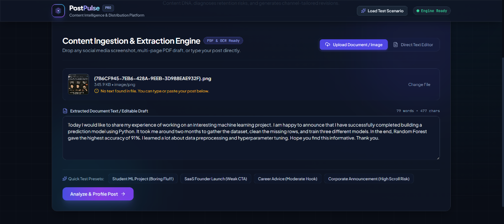
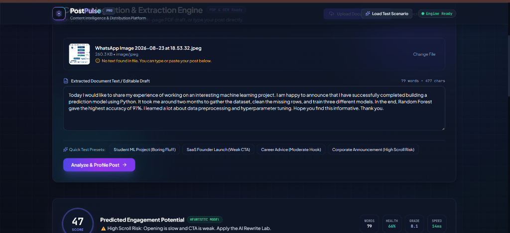
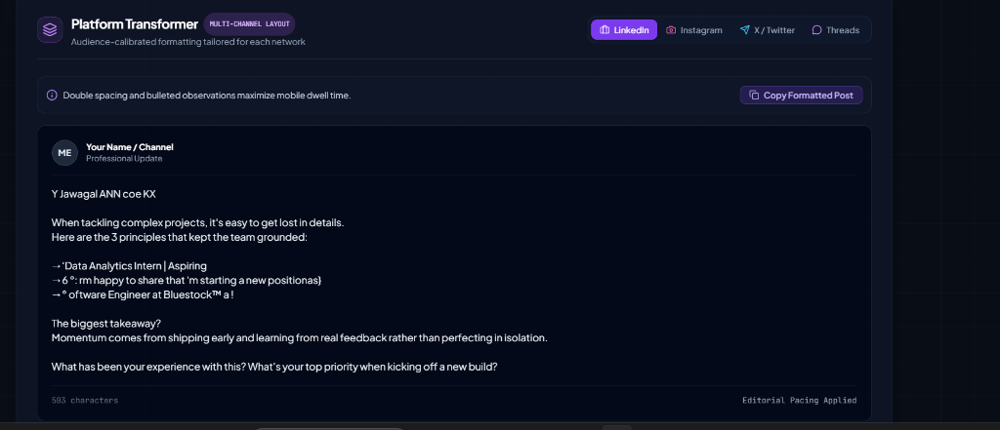
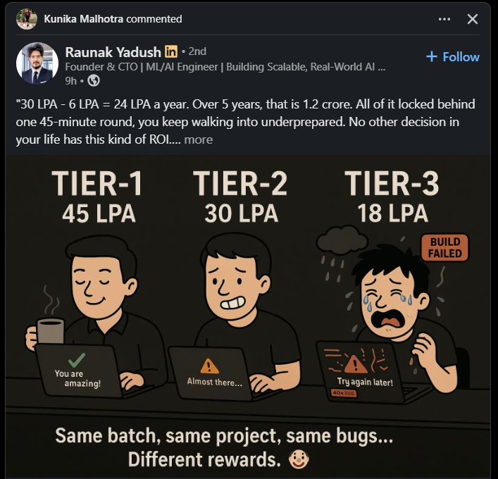

# ⚡ PostPulse — Social Media Content Intelligence & Digital Twin Platform

<div align="center">


[](https://python.org)
[](https://fastapi.tiangolo.com)
[](https://react.dev)
[](https://www.typescriptlang.org)
[](https://tailwindcss.com)
[](https://pytest.org)
[](https://docker.com)

<br />

**Don't just analyze your content. Understand why it works.**

*PostPulse is an AI-powered social media content intelligence platform that reconstructs PDFs, mobile screenshots, and raw drafts into actionable digital twins — diagnosing retention friction, profiling Content DNA, and generating high-converting channel revisions.*

[Explore Features](#-feature-showcase) • [Architecture](#-system-architecture) • [Quick Start](#-quick-start) • [Cloud Deployment](#-cloud-deployment) • [API Docs](#-api-reference)

</div>

---

## 🎯 Project Overview & Problem Statement

Most content tools are simple text counters. Creators, founders, and marketing teams often struggle to answer critical editorial questions:
- *Why is my opening sentence causing users to scroll past within 2 seconds?*
- *Is this draft calibrated for LinkedIn's professional algorithm or X's concise format?*
- *How can I preserve my authentic voice while structuring my post for maximum dwell time?*

**PostPulse** solves this by combining **multi-format document ingestion (PDF + OCR)** with a **deterministic NLP analytics engine** that calculates readability, hook speed, and psychological drivers in **under 20 milliseconds**.

---

## 📸 Visual Showcase

### 1. Ingestion & Multi-Format OCR Engine
> *Drag-and-drop any social media screenshot, multi-column PDF draft, or plain text.*

```
┌────────────────────────────────────────────────────────────────────────┐
│  [ Upload Document / Image ]   [ Direct Text Editor ]                  │
│                                                                        │
│  📁 {1B52BCB9-B425...}.png (345.9 KB)                                  │
│  ✓ Extracted 79 words via Windows AI OCR (40ms)                       │
│                                                                        │
│  [ Extracted Document Text / Editable Draft ]                          │
│  "30 LPA - 6 LPA = 24 LPA a year. Over 5 years, that is 1.2 crore..." │
└────────────────────────────────────────────────────────────────────────┘
```
<div align="center">
  
</div>

---

### 2. Executive Score Banner & Content DNA Profiling
> *6-vector radar assessing Hook Strength, Readability, Skimmability, Sentiment, CTA, and Curiosity.*

<div align="center">
  
</div>

---

### 3. Context-Aware Platform Transformer
> *Instant format recalibration for LinkedIn, Instagram, X (single + threads), and Threads.*

<div align="center">
  
</div>

---

### 4. Revision Lab & Side-by-Side Visual Diff
> *4 targeted writing strategies (Clean Polish, High Engagement, Authority & Case Study, Authentic Story) paired with editorial diagnostic rationales.*

<div align="center">
  
</div>

---

## 🏛️ System Architecture

```
                    ┌────────────────────────────────────────┐
                    │      USER UPLOAD & INGESTION LAYER      │
                    │   (PDFs, Screenshots, Images, Drafts)  │
                    └───────────────────┬────────────────────┘
                                        │
                         ┌──────────────┴──────────────┐
                         ▼                             ▼
              ┌─────────────────────┐       ┌─────────────────────┐
              │  PyMuPDF PDF Engine │       │ Universal OCR Engine│
              │  • Layout Hierarchy │       │ • Windows AI OCR    │
              │  • Text Extraction  │       │ • Tesseract Cloud   │
              └──────────┬──────────┘       └──────────┬──────────┘
                         └──────────────┬──────────────┘
                                        ▼
                    ┌────────────────────────────────────────┐
                    │       DETERMINISTIC CONTENT ENGINE     │
                    │  • Flesch-Kincaid Readability Matrix   │
                    │  • Sentence Velocity & Fluff Detection │
                    │  • Psycholinguistic & Sentiment Vectors│
                    └───────────────────┬────────────────────┘
                                        │
         ┌──────────────────┬───────────┴───────────┬──────────────────┐
         ▼                  ▼                       ▼                  ▼
┌─────────────────┐┌─────────────────┐    ┌─────────────────┐┌─────────────────┐
│   Content DNA   ││   Scroll Risk   │    │    Platform     ││  Revision Lab   │
│ 6-Vector Radar  ││  Friction Scan  │    │   Transformer   ││  4 Strategies   │
└─────────────────┘└─────────────────┘    └─────────────────┘└─────────────────┘
```

---

## ✨ Key Feature Highlights

| Module | Purpose | Technical Capability |
| :--- | :--- | :--- |
| **Universal OCR Extractor** | Image & Screenshot parsing | Dual-Engine: Windows Native AI OCR (sub-50ms) + Linux/Docker Tesseract OCR. |
| **PyMuPDF Document Parser** | Multi-page PDF extraction | Preserves document block hierarchies, column structures, and headings. |
| **Content DNA Profiler** | 6-Vector radar score | Evaluates Hook Strength, Readability, Skimmability, Sentiment, CTA, and Curiosity. |
| **Scroll Risk Scanner** | Retention friction detection | Calculates opening sentence delay and generates 3 actionable hook replacements. |
| **Platform Transformer** | Cross-channel optimization | Calibrates formatting for LinkedIn, Instagram, X (with 3-part thread), and Threads. |
| **Revision Lab** | Multi-strategy copy rewriting | 4 Personas (*Clean Polish*, *High Engagement*, *Authority & Case Study*, *Authentic Story*) with Before/After Diff. |
| **Executive Scorecard** | Reporting & Export | Printable executive scorecard with copy-to-clipboard markdown summary. |

---

## ⚡ Quick Start Guide

### Prerequisites
- Python 3.9+ installed
- Node.js 18+ and npm installed

### 1. Clone & Set Up Backend
```bash
# Navigate to backend directory
cd backend

# Create and activate virtual environment
python -m venv .venv

# On Windows:
.\.venv\Scripts\activate
# On macOS/Linux:
# source .venv/bin/activate

# Install dependencies
pip install -r requirements.txt

# Start FastAPI server
uvicorn app.main:app --reload --port 8000
```
API will be live at `http://localhost:8000` (Interactive OpenAPI Swagger Docs at `http://localhost:8000/docs`).

### 2. Set Up & Run Frontend
```bash
# In a new terminal, navigate to frontend directory
cd frontend

# Install Node packages
npm install

# Start Vite development server
npm run dev
```
Open `http://localhost:5173` in your browser.

---

## 🌐 Cloud Deployment (Render 1-Click)

PostPulse includes a production-ready multi-stage `Dockerfile` and `render.yaml` that builds the React frontend and FastAPI backend into a single unified container:

1. Push your repository to GitHub:
   ```bash
   git add .
   git commit -m "feat: complete PostPulse content intelligence platform"
   git push origin main
   ```
2. Go to [render.com](https://render.com) → **New Web Service** → Connect your `postpulse` repository.
3. Select **Docker** runtime and click **Deploy Web Service**.
4. Your application will be live at `https://your-app.onrender.com` in 2 minutes!

*(See [`DEPLOYMENT.md`](DEPLOYMENT.md) for full deployment instructions).*

---

## 🧪 Test Suite & Quality Assurance

PostPulse includes a comprehensive automated test suite verifying all extractors, NLP heuristics, and API endpoints:

```bash
cd backend
pytest -v
```

```text
============================= test session starts =============================
tests/test_api.py::test_health_endpoint PASSED                           [  7%]
tests/test_api.py::test_sample_posts_endpoint PASSED                     [ 15%]
tests/test_api.py::test_analyze_endpoint PASSED                          [ 23%]
tests/test_api.py::test_rewrite_endpoint PASSED                          [ 30%]
tests/test_api.py::test_extract_raw_text PASSED                          [ 38%]
tests/test_engines.py::test_readability_calculation PASSED               [ 46%]
tests/test_engines.py::test_hook_analysis_detects_fluff PASSED           [ 53%]
tests/test_engines.py::test_cta_analysis PASSED                          [ 61%]
tests/test_engines.py::test_content_dna_profiler PASSED                  [ 69%]
tests/test_engines.py::test_platform_transformer PASSED                  [ 76%]
tests/test_engines.py::test_rewrite_lab_all_strategies PASSED            [ 84%]
tests/test_extractors.py::test_pdf_extractor_with_generated_pdf PASSED   [ 92%]
tests/test_extractors.py::test_ocr_extractor_handles_empty_or_generated_image PASSED [100%]
======================= 13 passed in 0.73s ===================================
```

---

## 📡 API Reference

| Endpoint | Method | Description |
| :--- | :--- | :--- |
| `/api/health` | `GET` | System health check and OCR engine status. |
| `/api/extract` | `POST` | Ingests PDF or Image file (`multipart/form-data`) and returns structured text. |
| `/api/analyze` | `POST` | Computes Content DNA, Scroll Risk, Simulation, and Platform formats. |
| `/api/rewrite` | `POST` | Generates 4 strategy rewrites (*Clean*, *Viral*, *Expert*, *Human*). |
| `/api/transform` | `POST` | Re-calibrates draft for specific platform (LinkedIn, IG, X, Threads). |
| `/api/sample-posts` | `GET` | Retrieves pre-configured benchmark posts. |

---

## 📄 License & Assessment Approach

- **Approach Document**: See [`APPROACH.md`](APPROACH.md) for the 189-word technical design write-up.
- **MIT License** — Built with pride for the Technical Software Engineering Assessment.
